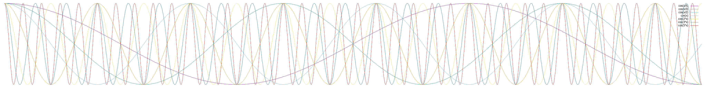

# `cosign`: Cooperative RSA signatures

The `cosign` tool allows multiple cooperating parties to generate an RSA
key and split the private key into shards between themselves, and then
perform partial signatures of a message that can be combined into a single
valid RSA signature of that message, without any of the parties having
a complete copy of the private key after the initial key generation stage.

In the general number of parties is unlimited, although this is not
a threshold signature scheme where only a subset are required -- with
`cosign` all the parties must perform their partial signature to be able
to generate a valid RSA signature.  It is also simplified in that the
initial key splitting stage requires a "trusted dealer" to perform the
split and hand the shards to the parties.

There is a separate threshold mode that splits the key into three shards,
two of which are required for signatures.  If the third shard is lost,
the two can be recombined to create a new set of three shards.  This requires
doing two signature operations for each signature and then selecting
the correct of these for a pairwise combination that produces a valid
signature.  Larger N-of-K schemes are possible, but this is an easy
approach.


**WARNING**
`cosign` is currently in the proof-of-concept stage.  The security
properties of the key sharding has not been reviewed for vulnerabilities
and the Python modular exponentiation function is not side-channel safe.

# Example use cases

One use case for this sort of signature system is an automated Certificate
Authority (CA) that signs SSL certs.  By splitting the CA's Root Key to
multiple separate machines it becomes harder for an attacker to steal
the root key and produce unauthorized signed certs for domains they do
not control.  The logging mechanisms can also be spread across multiple
machines, making it harder for rogue certs to be secretly signed.

Another example use for this is to interoperate with UEFI Secureboot,
which requires a single RSA signature on an executable to accept it.
For high-assurance use cases, it is desirable that multiple parties must
reproducibly build the firmware image and individually sign the image
so that no single developer can subvert the security of the boot process.

In the unanimous mode (or a k-of-k threshold), a valid signature also
indicates unanimous consent by the parties performing the signing.
If any of them do not sign or provide a bad partial signature, then the
resulting merged signature will not be valid.  It is not possible to
identify which party generated an invalid partial signature.


# Usage

The tool has a few modes: key generation (unanimous or threshold),
partial signature generation, partial signature merging, and
threshold key regeneration.


## Key generation and dealing

```
cosign genkey N basename
```

Produces a 2048 bit RSA key pair in memory and divides it into N private key
shares `basename-0.key`, `basename-1.key`, ...  `basename-(N-1).key`
and the public key `basename.pub`.  The public key can be published and
the inidividual key shares should be sent to the cosigners under separate
secured channels.

After generation the shares should never be brought together since the
private key can be regenerated from all of them together.
Additionally, the key shards currently are not password protected,
so the recipients must protect them.


```
cosign threshold basename [keyN.key keyM.key]
```

Generates a 2048 bit RSA key pair in memory, or if two shards are
provided regenerates the private key from them, then divides the
private key into three private key shares.

After generation the shares should never be brought together since the
private key can be regenerated from all of them together.
Additionally, the key shards currently are not password protected,
so the recipients must protect them.

These threshold keys are not proper RSA keys and must be used with
the `cosign` tool.  Two out of the three are required to produce
a signature.


## Partial signature generation

```
cosign sign key-n.key < file > sig-n
```

Uses partial key to hash stdin and pad the hash with PKCS#1 v1.5, then
sign the padded value with the partial key and writes signature to stdout.
Each cosigning party must do this separately and send their partial
signatures to a coordinator to combine them.

This process must be done on a trusted machine to avoid leaking
the private key shard.  The cosigning parties can work in parallel
and do not need to communicate other than that they are all signing
the same message.

For threshold keys the signatures are done twice, once for each
pair-wise portion of the private key that they hold.  Only two
of the three are required for merging.


## Signature merging
```
cosign merge key.pub sig-* > file.sig
```

Merges the partial signature files into a full signature.  For
unanimous keys all of the cosigning parties must produce partial
signatures, while threshold keys only require two of the three
shards.  In either case the partial signatures are sent
to the coordinator to combine them with `merge`.

This process requires no secret information (assuming the partial
signatures do not leak any key material), nor the contents of the message
itself, so it can be done by an untrusted machine or by any number of
machines in public to produce the valid RSA signature on the message.

Since the messages are deterministicly padded with PKCS#1 v1.5,
it is possible for the merge operation to detect that invalid
partial signatures have been provided, but not to determine which
party sent the invalid file.


## Verifying signature
```
openssl dgst -verify key.pub -signature file.sig < file
```

Verify the merged signature with the public key.  The value that
is actually signed is an PKCS#1-v1.5 encoded structure defined in
[RFC 3447 section 9.2](https://tools.ietf.org/html/rfc3447#section-9.2).


```
openssl rsautl -verify -pubin -inkey key.pub -asn1parse -in file
```

Produce an ASN1 tree of the signed file for debugging if
the verification fails for some reason.


# Limitations

`cosign` requires a trusted dealer to perform the key split.
The dealer can keep a copy of the whole private key or leak it
to one of the conspiring parties.

`cosign` does not have a general threshold system. 2-of-3 is implemented
since it only requires two signature operations; beyond that the
combinatorial complexity is quite high.  There is literature that
suggests better systems that might be doable.

The private key is recoverable if all of the shards are combined (or
two of the three for a threshold key).  This is a good thing if it is
desirable to be able to re-shard the key.  If the shards are stored in
a hardware token, it might be difficult to recover the shard in a format
that would allow recombination.

The security properties of the partial signatures is not known.
The random `d_i` values do not meet the coprime conditions, for instance.

Unfortunately the partial private keys are not compatible with hardware
tokens like Yubikeys since the key shards do not have the
[Chinese Remainder Theorem (CRT)](https://en.wikipedia.org/wiki/Chinese_remainder_theorem)
values, nor the primes `p` & `q` and the `dp` & `dq` values, that the
hardware tokens use to perform efficient RSA operations.  The threshold
keys especially are not suitable for hardware since they use non-standard
representation.


# Inspiration

This is inspired by an reply [posted to crypto.stackexchange.com](https://crypto.stackexchange.com/questions/67548/secure-multi-party-computation-for-digital-signature) by [@poncho](https://crypto.stackexchange.com/users/452/poncho)
as a "_fairly straight-forward method using RSA_", which is likely based on Boyd's
additive secret sharing:

> ## Key generation phase:
>
> The dealer selects a random RSA public/private keypair $(n,e,d)$
> 
> The dealer then selects $N$ values $d1,d2,…,dN$ with the constraint that $d1+d2+…+dN≡d(modλ(n))$
> 
> The dealer privately sends $d_i$ to party $i$, and publishes the public key $(n,e)$
>
> ## Signature generation phase:
>
> Each party gets a copy of the value to be signed $S$
> 
> Each party $i$ deterministically pads $S$ (perhaps using PKCS #1.5 signature padding,
> perhaps using PSS using randomness seeded by $S$), and then raises that to the power of $d_i mod n$;
> that is, it computes $sig_i=Pad(S)^{di} mod n$
> 
> Each party sends sigi to a collector, which computes $sig=sig1⋅sig2⋅…⋅s_n mod n$, and broadcasts it
> 
> Everyone checks if $sig$ is a valid signature to the value $s$; if not, then a malicious party is detected

There has been lots of other research into multiparty RSA going back to
Boyd ("Digital multisignatures" Cryptography and Coding, 1986).  Most of
the algorithm research has focused on threshold RSA and distributed
private key generation, although none of the literature seems to have
usable implementations.

There are some startups in this space as well, but they are not
using open source software nor publishing their algorithms, so they
are essentially both a trusted dealer and all of the trusted parties.


